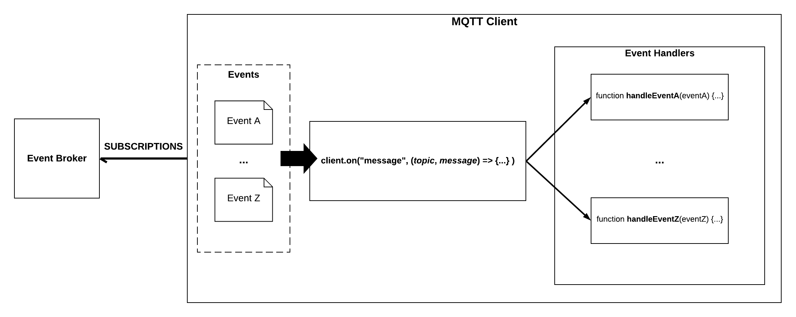

# "Event Handler" Pattern for MQTT

If you are tasked with building an event-driven microservice for a system that uses a publish/subscribe messaging pattern, you will need to manage topic subscriptions, topic dispatch, and callbacks.

This will likely include:

1. Subscribing your microservice's messaging client to a list of topics so that it will receive relevant message flows,
2. Configuring your microservice's messaging client to trigger certain functions for certain types of incoming messages
3. Configuring your microservice's messaging client to respond to client events (e.g. connection acknowledgement events)

## Purpose of this repository

If you're a developer that is primarily used to working with RESTful APIs, you're probably not used to managing these things.

Unfortunately, if you don't have a mentor to walk you through the basics of event-driven architecture and you try to learn how to manage these things on your own, you'll likely find that the verbiage of a lot of the documentation for popular messaging clients is pretty inaccessible. Examples provided by sites like [Eclipse Paho](https://www.eclipse.org/paho/clients/js/) are written using callbacks without any sort of indication as to how they're triggered, which makes it really hard to reason about the client's flow control.

What I've tried to provide in this repository is a replicable example of a Node.js event-driven microservice that uses [MQTT.js](https://github.com/mqttjs/MQTT.js). This example microservice includes a wrapper around an MQTT client that provides an easy to reason about abstraction for handling topic subscriptions and event dispatch, similar to what Spring Cloud Stream provides for event-driven microservices in Spring apps.

If you're used to working with AWS Lambda, you should be comfortable with this pattern. Think of the event-handlers as being individual Lambdas, and the MQTT client as being a mini API gateway of sorts that triggers Lambdas and forwards on events.

## Design

This clean separation between events, event handlers, and our MQTT client lets us write modular code that is readable by programmers who are not used to messaging!

## Repository structure

Check out the [source code](src/) to understand each of the objects visualized in the diagram above.
